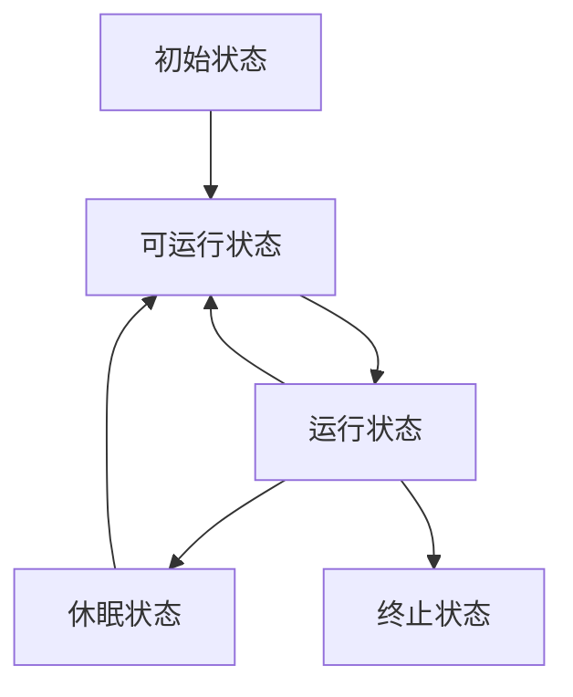

#  Java 并发编程基础

线程是Java语言中不可或缺的重要功能，并且它能充分发挥多处理器系统强大的计算能力，在 Java 领域，实现并发程序的主要手段就是多线程。

## 线程简介
现代操作系统调度的最小单元是线程（轻量级进程），在一个进程里可以创建多个线程，这些线程拥有各自的计数器、堆栈和局部变量等属性，并且能够访问共享的内存变量。处理器在线程上高速切换。

```java
    public static void main(String[] args) {
        //获取Java线程管理的MXBean
        ThreadMXBean threadMXBean = ManagementFactory.getThreadMXBean();
        //不需要获取同步的monitor和synchronizer信息,仅获取线程和线程堆栈信息
        ThreadInfo[] threadInfos = threadMXBean.dumpAllThreads(false,false);
        //遍历线程信息，仅打印线程ID和线程名称信息
        for (ThreadInfo threadInfo : threadInfos){
            System.out.println("[" + threadInfo.getThreadId() + "]" + threadInfo.getThreadName());
        }
    }
```

```javascript
[8]JDWP Command Reader
[7]JDWP Event Helper Thread
[6]JDWP Transport Listener: dt_socket
[5]Attach Listener
[4]Signal Dispatcher
[3]Finalizer
[2]Reference Handler
[1]main
```


### 线程的优势

#### 更多的处理器核心

多线程有利于利用处理器的上的多个核心。

#### 更快的响应时间

### 线程的优先级
线程优先级是决定线程需要多或者少分配一些处理器资源的线程属性。
现代操作系统基本采用时分的形式调度运行的线程,操作系统会分出多个时间片，线程会被分配到若干个时间片，当线程的时间片用完了就会发生线程调度，并且等待下次分配，线程得到的时间片多少决定了线程使用处理器资源的多少。

优先级高的线程分配时间片的数量要多于优先级低的线程

```
public class Priority {
    private static volatile boolean notStart = true;
    private static volatile boolean notEnd = true;

    public static void main(String[] args) {
        List<Job> jobs = new ArrayList<>();
        for (int i = 0; i < 10; i++){
            int priority = i < 5? Thread.MIN_PRIORITY : Thread.MAX_PRIORITY;
            Job job = new Job(priority);
            jobs.add(job);
            Thread thread = new Thread(job,"thread" + i);
            thread.setPriority(priority);
            thread.start();
        }
        notStart = false;
        try {
            TimeUnit.SECONDS.sleep(10);
            notEnd = false;
        } catch (InterruptedException e) {
            e.printStackTrace();
        }
        for (Job job : jobs){
            System.out.println("Job Priority:" + job.priority + ", count : " + job.jobCount);
        }
    }
    static class Job implements Runnable{
        private int priority;
        private long jobCount;

        public Job(int priority){
            this.priority = priority;
        }

        @Override
        public void run() {
            while (notStart){
                Thread.yield();
            }
            while (notEnd){
                Thread.yield();
                jobCount++;
            }
        }
    }
}
```

程序的正确性不能依赖线程优先级的高低

### 线程的状态

#### 通用的线程生命周期
通用的线程生命周期基本上可以用“五态模型”来描述。这五态分别是：初始状态、可运行状态、运行状态、休眠状态和终止状态。



- 初始状态，指的是线程已经被创建，但是还不允许分配 CPU 执行。这个状态属于编程语言特有的，不过这里所谓的被创建，仅仅是在编程语言层面被创建，而在操作系统层面，真正的线程还没有创建。
- 可运行状态，指的是线程可以分配 CPU 执行。在这种状态下，真正的操作系统线程已经被成功创建，可以分配 CPU 执行。
- 当有空闲的 CPU 时，操作系统会将其分配给一个处于可运行状态的线程，被分配到CPU 的线程的状态就转换成了运行状态。
- 运行状态的线程如果调用一个阻塞的 API（例如以阻塞方式读文件）或者等待某个事件（例如条件变量），那么线程的状态就会转换到休眠状态，同时释放 CPU 使用权，休眠状态的线程永远没有机会获得 CPU 使用权。当等待的事件出现了，线程就会从休眠状态转换到可运行状态。
- 线程执行完或者出现异常就会进入终止状态，终止状态的线程不会切换到其他任何状态，进入终止状态也就意味着线程的生命周期结束了。

#### Java 中线程的生命周期

```java
public class ThreadStatus {
    public static void main(String[] args) {
        new Thread(new TimeWaiting(),"TimeWaitingThread").start();
        new Thread(new Waiting(),"WaitingThread").start();
        //使用两个blocked 线程,一个获取锁成功,另外一个阻塞
        new Thread(new Blocked(),"BlockedThread-1").start();
        new Thread(new Blocked(),"BlockedThread-2").start();
    }
    //该线程不断进行睡眠
    static class TimeWaiting implements  Runnable{
        @Override
        public void run() {
            while (true){
                SleepUtils.second(100L);
            }
        }
    }

    //该线程在Waiting.class 实例上等待
    static class Waiting implements Runnable{
        @Override
        public void run() {
            while (true){
                synchronized (Waiting.class){
                    try {
                        Waiting.class.wait();
                    } catch (InterruptedException e) {
                        e.printStackTrace();
                    }
                }
            }
        }
    }

    //该线程在Blocked.class实力上加锁后,不释放该锁
    static class Blocked implements Runnable{
        @Override
        public void run() {
            synchronized (Blocked.class){
                while (true){
                    SleepUtils.second(100L);
                }
            }
        }
    }
}

```


1. NEW（初始化状态）:编程语言层面被创建，调用start（）方法，真正的线程创建。
2. RUNNABLE（可运行 / 运行状态）：Java线程将操作系统中的就绪和运行两种状态笼统称为“运行中”。
3. BLOCKED（阻塞状态）：线程阻塞于锁
4. WAITING（无时限等待）：当前线程需要等待其他线程做出一些特定的动作（通知/中断）
5. TIMED_WAITING（有时限等待）：可以在指定的时间自行返回
6. TERMINATED（终止状态）：当前线程执行完毕

BLOCKED、WAITING、TIMED_WAITING 是一种状态，通用的线程状态的休眠状态。也就是说只要 Java 线程处于这三种状态之一，那么这个线程就永远没有 CPU 的使用权。


### Daemon 线程

Daemon 线程是一种支持型线程，主要用作程序中后台调度以及支持性工作。java 虚拟机中没有非Deamon线程的时候。Java虚拟机讲会退出。

```java
public class Deamon {
    public static void main(String[] args) {
        Thread thread = new Thread(new DaemonRunner(),"DaemonRunner");
        thread.setDaemon(true);//此方法设置为Daemon方法,并且在启动线程之前设置
        thread.start();
    }
    static class DaemonRunner implements Runnable{
        @Override
        public void run() {
            try {
                SleepUtils.second(5L);
            }finally {
                System.out.println("DaemonThread finally run.");
            }
        }
    }
}
```

###  管道输入/输出流

管道输入/输入流主要用于线程之间的数据传输，传输的媒介为内存

```java
public class Piped {
    public static void main(String[] args) throws IOException {
        PipedWriter out = new PipedWriter();
        PipedReader in = new PipedReader();
        //将输出流和输入流进行连接,否则在使用的时候会抛出IOException
        out.connect(in);
        Thread thread = new Thread(new Print(in),"PrintThread");
        thread.start();
        int receive = 0;
        try {
            while ((receive = System.in.read()) != -1){
                out.write(receive);
            }
        }finally {
            out.close();
        }
    }

    static class Print implements Runnable{
        private PipedReader in;
        public Print(PipedReader in){
            this.in = in;
        }
        @Override
        public void run() {
            int receive = 0;
            while (true) {
                try {
                    if ((receive = in.read()) != -1){
                        System.out.print((char)receive);
                    }
                } catch (IOException e) {
                    e.printStackTrace();
                }
            }
        }
    }
}

```


### 启动和终止线程

#### 构造线程


package java.lang.Thread;

```java
/**
 * Initializes a Thread.
 *
 * @param g the Thread group 线程组
 * @param target the object whose run() method gets called 调用其run（）方法的对象
 * @param name the name of the new Thread 新线程的名称
 * @param stackSize the desired stack size for the new thread, or 
 *        zero to indicate that this parameter is to be ignored. 新线程所需的堆栈大小，或零表示将忽略此参数。
 * @param acc the AccessControlContext to inherit, or
 *            AccessController.getContext() if null下`
 * @param inheritThreadLocals if {@code true}, inherit initial values for
 *            inheritable thread-locals from the constructing thread
 */
private void init(ThreadGroup g, Runnable target, String name,
                  long stackSize, AccessControlContext acc,
                  boolean inheritThreadLocals) {
    if (name == null) {
        throw new NullPointerException("name cannot be null");
    }

    this.name = name;
//当前线程是该线程的父线程
    Thread parent = currentThread();
    SecurityManager security = System.getSecurityManager();
    if (g == null) {
        /* Determine if it's an applet or not */

        /* If there is a security manager, ask the security manager
           what to do. */
        if (security != null) {
            g = security.getThreadGroup();
        }

        /* If the security doesn't have a strong opinion of the matter
           use the parent thread group. */
        if (g == null) {
            g = parent.getThreadGroup();
        }
    }

    /* checkAccess regardless of whether or not threadgroup is
       explicitly passed in. */
    g.checkAccess();

    /*
     * Do we have the required permissions?
     */
    if (security != null) {
        if (isCCLOverridden(getClass())) {
            security.checkPermission(SUBCLASS_IMPLEMENTATION_PERMISSION);
        }
    }

    g.addUnstarted();

    this.group = g;
    //属性设置为父线程对应的属性
    this.daemon = parent.isDaemon();
    this.priority = parent.getPriority();
    if (security == null || isCCLOverridden(parent.getClass()))
        this.contextClassLoader = parent.getContextClassLoader();
    else
        this.contextClassLoader = parent.contextClassLoader;
    this.inheritedAccessControlContext =
            acc != null ? acc : AccessController.getContext();
    this.target = target;
    setPriority(priority);
    if (inheritThreadLocals && parent.inheritableThreadLocals != null)
        this.inheritableThreadLocals =
            ThreadLocal.createInheritedMap(parent.inheritableThreadLocals);
    /* Stash the specified stack size in case the VM cares */
    this.stackSize = stackSize;

    /* Set thread ID */
    //分配一个线程id
    tid = nextThreadID();
}
```

新构造的线程对象是由父线程来进程空间分配,新构造的线程继承了父线程是否为Deamon,优先级和加载资源的contextClassLoader,以及可继承的ThreadLocal,分配一个线程id

#### 中断线程

中止线程意味着在线程处理完任务之前停止正在做的事情

- 使用退出标志使线程正常退出那边 

  ```
  public class Shutdowm {
  
      public static void main(String[] args) throws InterruptedException {
          Runner one = new Runner();
          Thread countThread = new Thread(one,"CountThread");
          countThread.start();
          TimeUnit.SECONDS.sleep(1);
          countThread.interrupt();
          Runner two = new Runner();
          countThread = new Thread(two,"CountThread");
          countThread.start();
          TimeUnit.SECONDS.sleep(1);
          two.cancel();
      }
  
      private static class Runner implements  Runnable{
          private long i;
          private volatile boolean on = true;
          @Override
          public void run() {
              while (on && !Thread.currentThread().isInterrupted()){
                  i++;
              }
              System.out.println("Count i =" + i);
          }
          public void cancel(){
              on = false;
          }
      }
  }
  ```

- 使用stop(),resume()\suspend()方法强行停止,不推荐使用.stop()退出不会释放锁等资源不能正常释放,suspend()调用后线程占有资源,容易导致死锁等.

- 使用interrupt()方法中断线程

  - 调用interrupt()方法仅仅是在当前线程中做了一个停止的标记
  - 判断线程是否为停止状态
    - interrupted():测试当前线程是否已经是中断状态,执行后具有清除状态标记值为false的功能.
    - isInterrupted():测试线程Thread对象是否已经是中断状态,不清除状态标志.

```java
public class Interrupted {
    public static void main(String[] args) {
        Thread sleepThread = new Thread(new SleepRunner(), "SleepThread");
        sleepThread.setDaemon(true);
        Thread busyThread = new Thread(new BusyRunner(), "BusyThread");
        busyThread.setDaemon(true);
        sleepThread.start();
        busyThread.start();
        //让上述两个线程运行一会
        try {
            TimeUnit.SECONDS.sleep(5L);
        } catch (InterruptedException e) {
            e.printStackTrace();
        }
        sleepThread.interrupt();
        busyThread.interrupt();
        System.out.println("SleepThread->" + sleepThread.isInterrupted());
        System.out.println("BusyThread->" + busyThread.isInterrupted());
        SleepUtils.second(2L);
    }

    static class SleepRunner implements Runnable{
        @Override
        public void run() {
            while (true){
                SleepUtils.second(10L);
            }
        }
    }

    static class BusyRunner implements Runnable {

        @Override
        public void run() {
            while (true){

            }
        }
    }
}
```

如果，线程的当前状态处于非阻塞状态，那么仅仅是线程的中断标志被修改为true而已（2）如果线程的当前状态处于阻塞状态，那么在将中断标志设置为true后，如果是 wait、sleep以及join 三个方法引起的阻塞，那么会将线程的中断标志重新设置为false，并抛出一个InterruptedException ，这样受阻线程就得以退出阻塞的状态。

### 线程通信

#### volatile和synchronize关键字

volatile修饰字段(成员便变量),告知程序对该变量的访问需要从共享内存中获取

synchronize确保线程在同一时刻,只能有一个线程处于方法或者同步代码块中,保证了线程对变量访问的可见性和排他性

#### 等待通知机制

一个线程A调用了对象O的wait()方法,进入等待状态,而另一个线程B调用对象O的notify或者notifyAll()方法.线程A收到通知后从对象O的wait()方法返回,进而执行后续操作.两个线程通过对象O来完成交互,而对象上的wait()和notify/notifyAll(),用来完成等待方和通知方之间的交互.

```java
public class WaitNotify {
    static boolean flag = true;
    static Object lock = new Object();

    public static void main(String[] args) throws InterruptedException {
        Thread waitThread = new Thread(new Wait(),"WaitingThread");
        waitThread.start();
        TimeUnit.SECONDS.sleep(1L);
        Thread notifyThread = new Thread(new Notify(),"NotifyThread");
        notifyThread.start();
    }
    
    static class Wait implements Runnable{
        @Override
        public void run() {
            //加锁，拥有lock的Monitor
            synchronized (lock){
                //当条件不满足时候,继续wait,同时释放lock的锁
                System.out.println(Thread.currentThread() + "flag is true. wait@" + new SimpleDateFormat("HH:mm:ss").format(new Date()));
                try {
                    lock.wait();
                } catch (InterruptedException interruptedException) {
                    interruptedException.printStackTrace();
                }
            }
            //条件满足时候完成工作
            System.out.println(Thread.currentThread() + "flag is false, running@" + new SimpleDateFormat("HH:mm:ss").format(new Date()));
        }
    }
    
    
    static class Notify implements Runnable{
        @Override
        public void run() {
        //加锁，拥有lock的Monitor
           synchronized (lock){
               //获取lock的锁,然后进行通知，通知时不会释放lock的锁。直到当前线程释放了lock后，WaitThread才能从wait方法中返回
               System.out.println(Thread.currentThread() + "hold Lock. notify@" + new SimpleDateFormat("HH:mm:ss").format(new Date()));
               lock.notifyAll();
               flag = false;
               SleepUtils.second(5L);
           }
           synchronized (lock){
               System.out.println(Thread.currentThread() + "hold Lock again. notify@" + new SimpleDateFormat("HH:mm:ss").format(new Date()));
               SleepUtils.second(5L);
           }
        }
    }
}

```

- 等待方遵循以下原则

  - 获取对象的锁

  - 如果条件不满足,那么调用对象的wait方法,被通知后仍要检查条件

  - 条件满足则执行对应的逻辑

    ```
    synchronized(对象){
    	while(条件不满足){
    		对象.wait();
    	}
    }
    对应的逻辑
    ```

- 通知方遵循的原则

  - 获得对象的锁

  - 改变条件

  - 通知所有等待在对象上的线程

    ```
    syncronized(对象){
    	改变条件
    	对象.notifyAll();
    }
    ```

#### Thread.join()

如果一个线程A执行了thread.join语句。线程A等待thread线程终止之后才能从thread.join()返回

```java
public class Join {
    public static void main(String[] args) {
        Thread previous = Thread.currentThread();
        for (int i = 0; i < 10; i++){
            //每个线程拥有前一个线程的引用，需要等待前一个线程终止，才能从等待中返回
            Thread thread = new Thread(new Domino(previous),String.valueOf(i));
            thread.start();
            previous = thread;
        }
    }
    static class Domino implements Runnable{
        private Thread thread;
        public Domino(Thread thread){
            this.thread = thread;
        }
        @Override
        public void run() {
            try {
                thread.join();
            } catch (InterruptedException interruptedException) {
                interruptedException.printStackTrace();
            }
            System.out.println(Thread.currentThread().getName() + " terminate");
        }
    }
}
```

JDK中Thread.join方法源码

```java
    public final synchronized void join(long millis)
    throws InterruptedException {
        long base = System.currentTimeMillis();
        long now = 0;

        if (millis < 0) {
            throw new IllegalArgumentException("timeout value is negative");
        }

        if (millis == 0) {
            while (isAlive()) {
                wait(0);
            }
        } else {
            while (isAlive()) {
                long delay = millis - now;
                if (delay <= 0) {
                    break;
                }
                wait(delay);
                now = System.currentTimeMillis() - base;
            }
        }
    }
```


#### ThreadLocal

线程变量,一个线程可以根据一个ThreadLocal对象查询到绑定在这个线程上的一个值

通过set（T）方法来设置一个值，在当前线程下通过get（）方法获取到原来设置的值

```java
public class Profiler {
    private static final ThreadLocal<Long> TIME_THREADLOCAL = new ThreadLocal<Long>(){
        @Override
        protected Long initialValue(){
            return System.currentTimeMillis();
        }
    };


    public static final void begin(){
        TIME_THREADLOCAL.set(System.currentTimeMillis());
    }

    public static final long end(){
        return System.currentTimeMillis() - TIME_THREADLOCAL.get();
    }

    public static void main(String[] args) throws InterruptedException {
        Profiler.begin();
        TimeUnit.SECONDS.sleep(1);
        System.out.println("Cost:" + Profiler.end() + " mills");
    }
}

```

ThreadLocal为什么会导致内存泄漏

由于ThreadLocal对象是弱引用，如果外部没有强引用指向它，它就会被GC回收，导致Entry的Key为null，如果这时value外部也没有强引用指向它，那么value就永远也访问不到了，按理也应该被GC回收，但是由于Entry对象还在强引用value，导致value无法被回收，这时「内存泄漏」就发生了，value成了一个永远也无法被访问，但是又无法被回收的对象。

Entry对象属于ThreadLocalMap，ThreadLocalMap属于Thread，如果线程本身的生命周期很短，短时间内就会被销毁，那么「内存泄漏」立刻就会得到解决，只要线程被销毁，value也会随之被回收。问题是，线程本身是非常珍贵的计算机资源，很少会去频繁的创建和销毁，一般都是通过线程池来使用，这就将线程的生命周期大大拉长，「内存泄漏」的影响也会越来越大。


## 线程安全性

### 什么是线程安全性

当多个线程访问某个类时，这个类始终能表现出正确的行为，这个类是线程安全的

#### 线程切换带来的原子性问题

现代的操作系统都基于更轻量的线程来调度，现在的“任务切换”都是指“线程切换”。

使用高级语言编程，高级语言里一条语句往往需要多条 CPU 指令完成，例如count += 1，至少需要三条 CPU 指令。
指令 1：需要把变量 count 从内存加载到 CPU 的寄存器；
指令 2：在寄存器中执行 +1 操作；
指令 3：将结果写入内存（缓存机制导致可能写入的是 CPU 缓存而不是内存）。

操作系统做任务切换，可以发生在任何一条CPU 指令执行完。

CPU能保证的原子操作是 CPU 指令级别的，而不是高级语言的操作符

#### 缓存导致的可见性问题

```java
public class Count {
    public static void main(String[] args) {
        CountAdd countAdd = new CountAdd();
        Thread thread1 = new Thread(countAdd,"count1");
        Thread thread2 = new Thread(countAdd,"count2");
        thread1.start();
        thread2.start();
    }
    static class CountAdd implements Runnable{

        private int num = 0;
        @Override
        public void run() {
            for (int i = 0; i< 10000;i++){
                num++;
            }
            System.out.println(num);
        }
    }
}
```


#### 编译优化带来的有序性问题

有序性指的是程序按照代码的先后顺序执行。编译器为了优化性能，有时候会改变程序中语句的先后顺序，例如程序中：“a=6；b=7；”编译器优化后可能变成“b=7；a=6；

```java
public class Singleton {
    static Singleton instance;
    static Singleton getInstance(){
        if (instance == null){
            synchronized (Singleton.class){
                if (instance == null){
                    instance = new Singleton();
                }
            }
        }
        return instance;
    }
}
```


new 操作上，我们以为的 new 操作应该是：
1. 分配一块内存 M；
2. 在内存 M 上初始化 Singleton 对象；
3. 然后 M 的地址赋值给 instance 变量

但是实际上优化后的执行路径却是这样的：

1. 分配一块内存 M；
2. 将 M 的地址赋值给 instance 变量；
3. 最后在内存 M 上初始化 Singleton 对象。

### 多线程问题解决方案
#### Java内存模型
Java 内存模型规范了 JVM 如何提供按需禁用缓存和编译优化的方法。这些方法包括

- volatile
- synchronized 
- final 
- 六项Happens-Before 规则

#### 解决可见性

volatile 关键字在古老的 C 语言里也有，它最原始的意义就是禁用CPU 缓存。

#### 解决有序性

```java
public class VolatileExample implements Runnable{
    int x = 0;
    volatile boolean v = false;
    @Override
    public void run() {
        x = 42;
        v = true;
    }
}
```


Happens-Before 规则：前面一个操作的结果对后续操作是可见的。Happens-Before 约束了编译器的优化行为，虽允许编译器优化，但是要求编译器优化后一定遵守 Happens-Before 规则。

1. 程序顺序规则：一个线程中的每个操作，happens-before于该线程中的任意后续操作。
2. 监视器锁规则：对一个锁的解锁，happens-before于随后对这个锁的加锁。
3. volatile变量规则：对一个volatile域的写，happens-before于任意后续对这个volatile域的读。
4. 传递性：如果A happens-before B，且B happens-before C，那么A happens-before C。
5. start()规则：如果线程A执行操作ThreadB.start()（启动线程B），那么A线程的ThreadB.start()操作happens-before于线程B中的任意操作。
6. join()规则：如果线程A执行操作ThreadB.join()并成功返回，那么线程B中的任意操作happens-before于线程A从ThreadB.join()操作成功返回。
7. 程序中断规则：对线程interrupted()方法的调用先行于被中断线程的代码检测到中断时间的发生。
8. 对象finalize规则：一个对象的初始化完成（构造函数执行结束）先行于发生它的finalize()方法的开始。

时间先后顺序与happens-before原则之间基本没有太大的关系，所以我们在衡量并发安全问题的时候不要受到时间顺序的干扰，一切必须以happens-before原则为准。

#### 解决原子性
原子性问题的源头是线程切换，禁用线程切换

如何禁止线程切换：加锁

Java 语言提供的锁技术：synchronized

互斥: 同一时刻只有一个线程执行 

临界区: 我们把需要互斥执行的代码看成为临界区

1. 解决原子性问题，就是要互斥，就是要保证中间状态对外不可见
2. 锁是解决原子性问题的关键，明确知道我们锁的是什么，要保护的资源是什么，更重要的要知道你的锁能否保护这个受保护的资源(图中的箭头指向)
3. 有效的临界区是一个入口和一个出口，多个临界区保护一个资源，也就是一个资源有多个并行的入口和多个出口，这就没有起到互斥的保护作用，临界区形同虚设
4. 锁自己家门能保护资源就没必要锁整个小区，如果锁了整个小区，这严重影响其他业主的活动(锁粒度的问题)
5. 加锁能够保证执行临界区代码的互斥性。临界区的代码是操作受保护资源的路径，类似于球场的入口，入口一定要检票，也就是要加锁，但不是随便一把锁都能有效。所以必须深入分析锁定的对象和受保护资源的关系，综合考虑受保护资源的访问路径，多方面考量才能用好互斥锁。

## 构建以及组合各种线程安全类的技术

## 使用java.util.concurrent包中的各种并发构建基础模块


原子性问题的源头是线程切换
同一时刻只有一个线程执行这个条件非常重要，我们称之为互斥

我们把一段需要互斥执行的代码称为临界区

解决原子性问题，是要保证中间状态对外不可见。

竞态条件，指的是程序的执行结果依赖线程执行的顺序

管程，指的是管理共享变量以及对共享变量的操作过程，让他们支持并发。

在并发编程领域，有两大核心问题：一个是互斥，即同一时刻只允许一个线程访问共享资源；另一个是同步，即线程之间如何通信、协作。

在 Java 领域，实现并发程序的主要手段就是多线程。

生命周期中各个节点的状态转换机制

通用的线程生命周期基本上可以用下图这个“五态模型”来描述。这五态分别是：初始状态、可运行状态、运行状态、休眠状态和终止状态。

对于 CPU 密集型的计算场景，理论上“线程的数量 =CPU 核数”就是最合适的

在工程上，线程的数量一般会设置为“CPU 核数 +1”，这样的话，当线程因为偶尔的内存页失效或其他原因导致阻塞时，这个额外的线程可以顶上，从而保证CPU 的利用率。

最佳线程数 =1 +（I/O 耗时 / CPU 耗时）

最佳线程数 =CPU 核数 * [ 1 +（I/O 耗时 / CPU 耗时）]

多研究原理性的东西、通用的东西，有这些东西之后再学具体的技术就快多了。


参考书籍：

《JAVA并发编程艺术》机械工业出版社

《JAVA并发编程实战》机械工业出版社

《JAVA多线程编程核心技术》机械工业出版社

极客时间 JAVA并发编程实战
